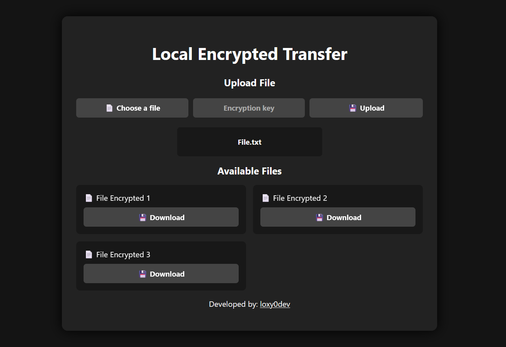

<h1 align="center">
  Local Encrypted Transfer
</h1>

  This tool allows secure file transfers using end-to-end encryption. Neither the content nor the file names are visible to your internet router. It enables easy file sharing between devices (computer, server, phone, etc.) as long as they are connected to the same network, via a locally hosted web interface.

<h2>🚀 Features:</h2>

<ul>
  <li>💻 Available on Windows and Linux.</li>
  <li>🔒 Secure communication over HTTPS (self-signed certificate).</li>
  <li>🔐 100% client-side end-to-end encryption with AES-GCM.</li>
  <li>🕵️ Server sees neither file content nor file names (everything is encrypted before upload).</li>
  <li>🔑 Password-based key derivation (PBKDF2).</li>
  <li>🌐 Local network (LAN) sharing.</li>
  <li>✨ Simple and user-friendly web interface.</li>
  <li>📁 Secure file upload & download via browser.</li>
  <li>🗑️ Automatic deletion after download: secure file overwrite, deletion, and cleanup of associated logs.</li>
</ul>

<h2>⚙️ Installation:</h2>

<ol>
  <li>Clone the repository:</li>
  <pre>git clone https://github.com/loxy0devlp/Local-Encrypted-Transfer.git</pre>

  <li>Enter the project folder:</li>
  <pre>cd Local-Encrypted-Transfer</pre>

  <li>Install Python dependencies:</li>
  <pre>pip install -r requirements.txt</pre>

  <li>Run the server:</li>
  <pre>python local_encrypted_transfer.py</pre>
</ol>

<h2>📋 Usage:</h2>

<ul>
  <li>Open your browser and access:</li>
  <ul>
    <li>https://localhost:9999</li>
    <li>https://YOUR_LOCAL_IP:9999</li>
  </ul>

  <li>Upload a file:</li>
  <ul>
    <li>Select a file.</li>
    <li>Enter an encryption key.</li>
    <li>Click on upload.</li>
  </ul>

  <li>Download a file:</li>
  <ul>
    <li>Click download.</li>
    <li>Enter the decryption key.</li>
  </ul>
</ul>

<h2>⚠️ Important:</h2>

<ul>
  <li>If you lose the encryption key, the file cannot be recovered.</li>
  <li>Tool designed for local network (LAN) usage.</li>
  <li>Devices must be on the same network.</li>
  <li>Uses self-signed HTTPS (browser warning is normal).</li>
</ul>

<h2>📸 Preview:</h2>

<h2>👨‍💻 Credits:</h2>

<ul>
  <li>Developed by: <b>loxy0dev</b></li>
  <li>GitHub: <a href="https://github.com/loxy0devlp">github.com/loxy0devlp</a></li>
  <li>GunsLol: <a href="https://guns.lol/loxy0dev">guns.lol/loxy0dev</a></li>
  <li>Version: <b>v1.0</b></li>
</ul>
